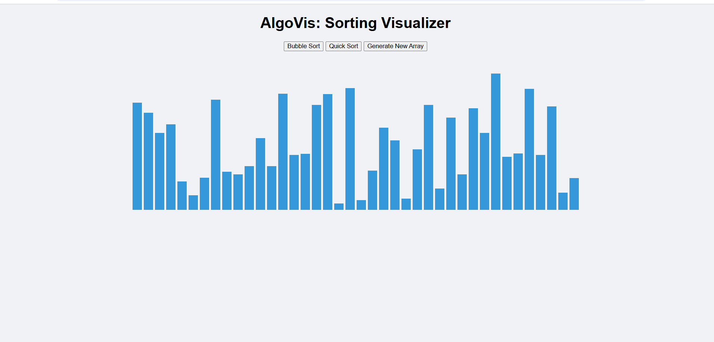

# AlgoVis – Sorting Algorithm Visualizer 🔢

A simple interactive web app to visualize sorting algorithms like **Bubble Sort** and **Quick Sort** with real-time animations.

## 🚀 Live Demo
👉 [Click here to open]( https://manish2006756.github.io/algovis/)

## 🛠️ Tech Stack
- HTML
- CSS
- JavaScript

## ✨ Features
- Animated visualizations of sorting algorithms
- Easy-to-use buttons to trigger sorting
- Responsive bar chart generation
- Clean and beginner-friendly code

## 📸 Screenshot

## 📁 How to Run Locally
1. Clone this repo or download the ZIP
2. Open `index.html` in your browser

## 📄 License
Free to use for learning purposes.
